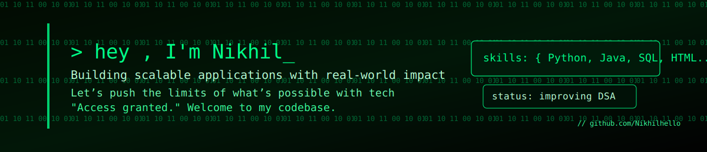

<h1 align="center">Hi 👋, I'm Nikhil Kuchana</h1>
<h3 align="center">A passionate in learning new things, frontend developer</h3>

# 💫 About Me:
I’m a tech enthusiast with a strong interest in software development and web technologies. I’ve worked on several academic projects involving Java, Servlets, and AngularJS, focusing on creating interactive and user-friendly applications.  Currently exploring opportunities to grow as a developer, contribute to real-world projects, and keep learning every day in this ever-evolving tech field.

<!-- Banner -->
<!-- 

  

   -->

  

---
<!-- Social Badges 
## 
🌐 Connect With Me
  -->

  
  
  
  
  
  

---

<!-- GIF Right with Top Spacing -->

## 🧑‍🎓 Academic Background

🎓 **Bachelor of Technology** — *Computer Science & Engineering*  
📍 SR University, Warangal    ` CGPA: 8.3/10 `          
📅 Year of Graduation: 2026

🏛️ **Polytechnic/Diploma** — *Computer Science & Engineering*  
📍 VMR Polytechnic, Warangal     ` CGPA: 7.3/10 `           
📅 Year of Graduation: 2023

<!-- <table>
<tr>
<td width="60%">
<h2>🧑‍🎓 Academic Background</h2>
🎓 <b>Bachelor of Technology</b> — <i>Computer Science & Engineering</i> 
📍 SR University, Warangal    ` CGPA: 8.3/10 `           
📅 Year of Graduation: 20XX  

<b>📚 Relevant Coursework:</b>
<ul>
  <li>Data Structures & Algorithms</li>
  <li>Database Management Systems</li>
  <li>Operating Systems</li>
  <li>Web Development</li>
</ul>
</td>
<td width="40%" align="center">

</td>
</tr>
</table> -->

 

## 
💻 Tech Stack

  
  
  
  
  
  
  
  
  
  
  
  
  
  
  
  
  
  
  

---

## 📌 Featured Projects
<table align="center">
  <tr>
    <!-- Project 1 -->
    <td align="center" width="300">
      <!-- Thumbnail -->
      <!--  -->
        
      <!-- Title + Icon -->
      <b>📚 E-LearnOverVidya</b>
       
      <i>Full-stack e-learning platform</i>
         
      <!-- Tech badges -->
      
      
      
      
      
      
        
      <!-- Links -->
      <a href="https://github.com/Nikhilhello/E-LearnOverVidya">🔗 View Code</a> • 
      <a href="https://your-live-demo-link.com">🚀 Live Demo</a>
    </td>
 
    <!-- Project 2 -->
    <td align="center" width="300">
      <!--  -->
       
      <b>🛡️ Image Steganography and Encryption Tool</b>
       
      <i>Short one-line description of the project.</i>
        
      
      
      
      
      
        
      <a href="https://github.com/your-username/project-2-repo">🔗 View Code</a> • 
      <a href="https://your-live-demo-link.com">🧪 API / Demo</a>
    </td>
 
    <!-- Project 3 -->
    <td align="center" width="300">
      <!--  -->
        
      <b>📘 Smart Study Planner</b>
       
      <i>Short one-line description of the project.</i>
        
      
      
      
      
        
      <a href="https://github.com/your-username/project-3-repo">🔗 View Code</a>
    </td>
  </tr>
</table>

---

 

## 
📊 GitHub Stats

  
   
  
   
  

---

 

## 
🏆 GitHub Trophies

  

---

 

  

---

<!-- Proudly created with GPRM ( https://gprm.itsvg.in ) -->

 drgfc3tryhcyt5bvy4utb4y

